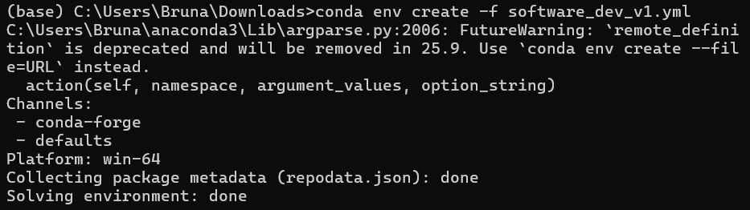
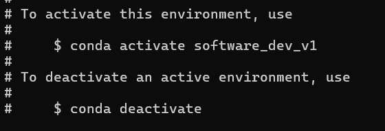

# PLUS_softwaredev_2025_bruna

This repository is part of the work developed during the Practice: Software Development course from the CDE master.

## Assignment 2 - Recreating Conda Environments
The goal of this assignment is to go through the process of re-creating an environment.

1. Download the environment files from professor's repository. 
 Used the link: https://github.com/augustinh22/geo-software-dev//archive/refs/heads/main.zip

2. Create the environment using conda:

3. If it worked, the following message will appear in the end of the process:

4. To activate the environment we just need to type the following simple command: `conda activate software_dev_v1.yml`. To deactivate the environment we just neet to type `conda deactivate`.

5. To recreate the second enviroment, we just need to redo all the command but specifying the other environment. I did it using the following command:  `conda env create -f software_dev_v2.yml` + `conda activate software_dev_v2.yml`.